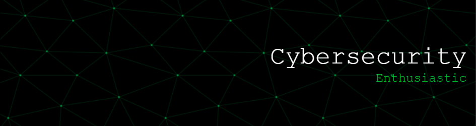

# Hi there, I'm Bryan Brown! 👋

## About Me 🚀

I'm a passionate Cybersecurity Enthusiast with a growing foundation in technology and security principles. As I begin my journey in this field, I'm eager to learn, solve complex challenges, and collaborate with others to build safe and innovative digital solutions. I'm continuously expanding my skills and excited about contributing to the ever-evolving world of cybersecurity.

- 🌱 Currently learning: Google Cybersecurity Certificate, ISC2 Certified in Cybersecurity (CC), Bash scripting, network fundamentals, and security best practices
- 🔭 Working on: Labs and hands-on projects in cybersecurity, improving Python scripting and SQL for threat detection and automation
- 🌍 Languages: SQL, Python (basic scripting), Bash (beginner), English, Spanish
- ⚡ Fun fact: I approach cybersecurity like solving puzzles—focused, curious, and always ready to outsmart the challenge.
- 📫 How to reach me:

  

## My Skills 🧠

## Featured Projects 💻

### [Bash Countdown Time]
https://github.com/Bryan3089/Bash-Countdown-Timer.git

